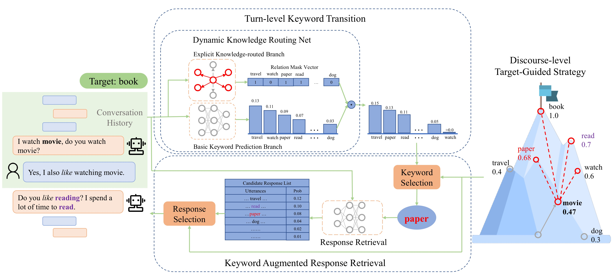

# Dynamic Knowledge Routing Network For Target-Guided Open-Domain Conversation

This repository contains the source code for the following paper:

[Dynamic Knowledge Routing Network For Target-Guided Open-Domain Conversation](https://arxiv.org/abs/2002.01196)  
Jinghui Qin, Zheng Ye, Jianheng Tang, Xiaodan Liang; AAAI 2020

## Model Overview


## Requirement
- `nltk==3.4.5`
- `tensorflow-gpu==1.14`
- `texar==0.2.1`
- `tqdm==4.36.1`
- `thulac==0.2.0`

To install the required packages, run:

```shell
pip install -r requirements.txt
```

## Usage

### Data Preparation
#TODO
Download the processed data([TGPC](https://drive.google.com/open?id=1Q4pRpFsxap2vqZ83mmMBpTNPnYpPxLHT), [CWC](https://drive.google.com/open?id=1NYBLxkLnGRNv720SLIcQyX7Um6rbxsAc)) and unzip them into the root directory of this code repository.

For the data preprocessing details, you could see the code inside the `preprocess` and `preprocess_weibo` directories.

### Turn-level Supervised Learning

In this project, we propose DKRN agent with more accurate next-topic prediction, compared with 5 different types of baseline agents (kernel/neural/matrix/retrieval/retrieval_stgy).
You can modify the configration of each agent in the `config` directory for the TGPC dataset and `config_weibo` directory for the CWC dataset.

To train our DKRN dialogue agent, you need to first train the keyword prediction module, and then train the response retrieval module:
```shell
python train.py --mode train_kw --agent neural_dkr
python train.py --mode train --agent neural_dkr
python train.py --mode test --agent neural_dkr
```

To train the baseline agents, change the `--agent` argument with a specific agent name (kernel/neural/matrix/).

Specially, for the retrieval and retrieval_stgy agents, you only need to train the response retrieval module:
```shell
python train.py --mode train --agent retrieval
python train.py --mode test --agent retrieval
```
Note: the retrieval agent and the retrieval_stgy agent share the same retrieval module. You only need to train one of them.

### Target-guided Conversation

After turn-level training, you can start target-guided conversation with our DKRN agent.
```shell
python target_chat.py --agent neural_dkr --times 3
```

You can also watch the simulation of the target-guided conversation between the retrieval agent pretending the user and our DKRN agent. The success rate and average turns would be shown in the end.

```shell
python target_simulation.py --agent neural_dkr --times 500 --dataset TGPC --print_details=False --use_fixed_start_corpus=True
```

Note:
1. Baseline agents (kernel/neural/matrix/retrieval/retrieval_stgy) are also supported by changing the `--agent` argument.
2. Set `--times` argument to indicate the conversation times or the simulation times.